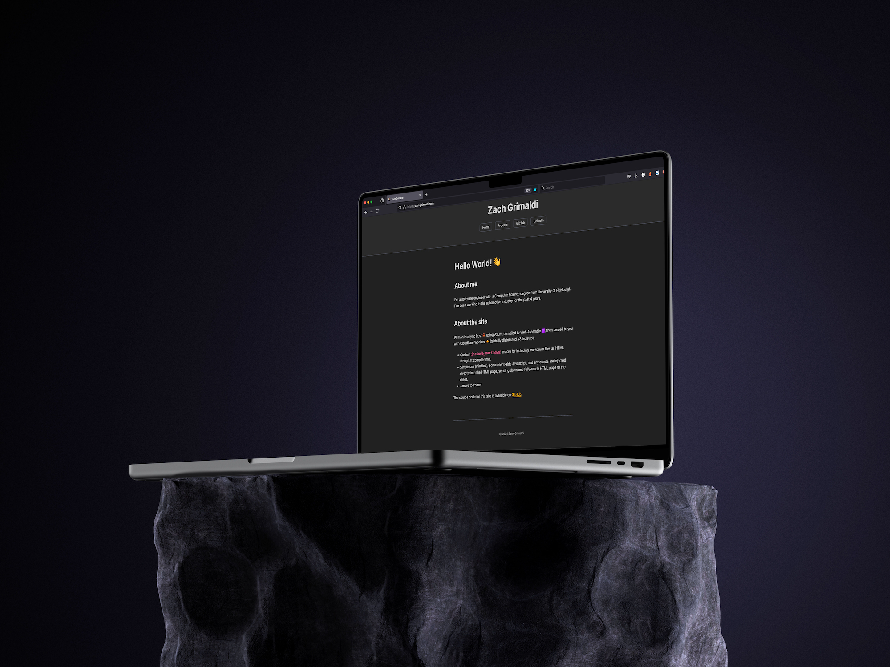

# `zachgrimaldi.com`

This is the source code for my personal website, [zachgrimaldi.com](https://zachgrimaldi.com).



## Tools Used

- 🔸 [Cloudflare Workers](https://workers.cloudflare.com/) for serverless hosting.
- ⛅️ [Wrangler CLI](https://developers.cloudflare.com/workers/wrangler/install-and-update/) for deploying to Cloudflare Workers.
- 🦀 [Workers Rust Bindings](https://github.com/cloudflare/workers-rs) for receiving requests, and eventually binding to other services like Workers KV or D1 databases.
- 📄 [pulldown-cmark](https://github.com/pulldown-cmark/pulldown-cmark/) to power our pre-processing of Markdown to HTML.
- ⚙️ [Wasm target for Rust](https://developers.cloudflare.com/workers/languages/rust/) to compile the Rust code to WebAssembly.
- 🎨 [Simple.css](https://simplecss.org/) for easy styling of HTML coming from Markdown.

## Commands

Run a local development server:

```
npx wrangler dev
```

Publish the website to Cloudflare Workers:

```
npx wrangler deploy
```

## Changelog

| Date       | Version | Description                                          |
| ---------- | ------- | ---------------------------------------------------- |
| 2024-11-26 | 1.0.3   | Add viewport meta tag to improve mobile experience.  |
| 2024-11-23 | 1.0.2   | Add fallback "Page not found" handler.               |
| 2024-11-23 | 1.0.1   | Add the GitHub repo to the _About the site_ section. |
| 2024-11-23 | 1.0.0   | Initial release to Cloudflare Workers.               |
